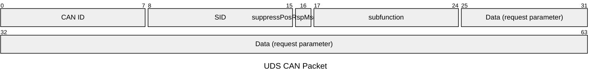

本文是本人学习UDS诊断是总结文档，如有错误希望能指出

# UDS OSI模型
{: width="972" height="589" }

_根据OSI模型实现UDS文档参考_

# 应用层服务

| 服务                            | SID  | 描述                              |
| ------------------------------- | ---- | --------------------------------- |
| DiagnosticSessionControl        | 0x10 | 客户端请求控制与服务器的诊断会话  |
| ECUReset                        | 0x11 | 复位ECU（电子控制单元）           |
| SecurityAccess                  | 0x27 | 安全访问                          |
| CommunicationControl            | 0x28 | 通信控制                          |
| TesterPresent                   | 0x3E | 测试器 Present                    |
| AccessTimingParameter           | 0x83 | 访问 timing 参数                  |
| SecuredDataTransmission         | 0x84 | 安全数据传输                      |
| ControlDTCSetting               | 0x85 | 控制 DTC（诊断 trouble code）设置 |
| ResponseOnEvent                 | 0x86 | 响应事件                          |
| LinkControl                     | 0x87 | 链接控制                          |
| ReadDataByIdentifier            | 0x22 | 通过标识符读取数据                |
| ReadMemoryByAddress             | 0x23 | 通过地址读取内存                  |
| ReadScalingDataByIdentifier     | 0x24 | 通过标识符读取缩放数据            |
| ReadDataByPeriodicIdentifier    | 0x2A | 通过周期标识符读取数据            |
| DynamicallyDefineDataIdentifier | 0x2C | 动态定义数据标识符                |
| WriteDataByIdentifier           | 0x2E | 通过标识符写入数据                |
| WriteMemoryByAddress            | 0x3D | 通过地址写入内存                  |
| ClearDiagnosticInformation      | 0x14 | 清除诊断信息                      |
| ReadDTCInformation              | 0x19 | 读取 DTC 信息                     |
| InputOutputControlByIdentifier  | 0x2F | 输入/输出控制通过标识符           |
| RoutineControl                  | 0x31 | routine 控制                      |
| requestDownload                 | 0x34 | 请求下载                          |
| requestUpload                   | 0x35 | 请求上传                          |
| TransferData                    | 0x36 | 传输数据                          |
| RequestTransferExit             | 0x37 | 请求传输退出                      |
| RequestFileTransfer             | 0x38 | 请求文件传输                      |

## 寻址的客户端类别

| 寻址方式 | CANID             | 发送源  | 接收源  |
| -------- | ----------------- | ------- | ------- |
| 功能寻址 | 功能寻址 CANID    | Tester  | All ECU |
| 物理寻址 | 指定ECU 受信CANID | Tester  | 指定ECU |
| 物理寻址 | 指定ECU 送信CANID | 指定ECU | Tester  |

## 请求帧格式 request message

## DiagnosticSessionControl(0x10)服务

DiagnosticSessionControl服务用于在服务器中启用不同的诊断会话。

 ### SubFunction
 
 | SubFunction                            | ID  | 描述                 |
 | -------------------------------------- | --- | -------------------- |
 | DefaultSession                         | 0   | 默认会话             |
 | ProgrammingSession                     | 1   | 编程会话             |
 | ExtendedDiagnosticSession              | 2   | 扩展诊断会话         |
 | SafetySystemDiagnosticSession          | 3   | 安全系统诊断会话     |
 | EmissionRelatedSystemDiagnosticSession | 4   | 排放相关系统诊断会话 |
 | OBDIIComplianceSession                 | 5   | OBDII合规性会话      |
 | UDSComplianceSession                   | 6   | UDS合规性会话        |
 | ECUResetSession                        | 7   | ECU重置会话          |
 
### 请求消息(Request Message)

| A_Data字节 | 参数名称                        | Cvt | 字节值    | 助记符  |
| ---------- | ------------------------------- | --- | --------- | ------- |
| #1         | DiagnosticSessionControl请求SID | M   | 0x10      | DSC     |
| #2         | 子函数=[diagnosticSessionType]  | M   | 0x00-0xFF | LEV_DS_ |

### 肯定应答（Positive Response）

| A_Data字节 | 参数名称                        | Cvt | 字节值      | 助记符  |
| ---------- | ------------------------------- | --- | ----------- | ------- |
| #1         | DiagnosticSessionControl响应SID | M   | 0x50(10+40) | DSC     |
| #2         | 子函数=[diagnosticSessionType]  | M   | 0x00-0xFF   | LEV_DS_ |
| #3         | sessionParameterRecord          | M   | 0x00-0xFF   | SPSR    |

> **diagnosticSessionType**

|byte |名称| 描述|CVT|
|-|-|-|-|
|0x01 | defaultSession|启用服务器中的默认诊断会话，并且不支持任何诊断应用程序超时 处理规定|M|
|0x02 | ProgrammingSession|启用支持服务器内存编程所需的所有诊断服务|U|
|0x03 | extendedDiagnosticSession|启用支持“怠速，CO值等”功能调整所需的所有诊断服务|U|
|0x04 | safetySystemDiagnosticSession|话支持所有需要的诊断服务，以支持与安全系统相关的功能|U|

> `sessionParameterRecord`
> | 参数           | 描述                                                      | 字节数 | 解析度 | 最小值 | 最大值      |
> | -------------- | --------------------------------------------------------- | ------ | ------ | ------ | ----------- |
> | P2Server\_max  | 服务器支持激活的诊断会话的默认P2Server\_max计时。         | 2      | 1毫秒  | 0毫秒  | 65 535毫秒  |
> | P2*Server\_max | 增强型（NRC 0x78）P2Server\_max服务器支持激活的诊断会话。 | 2      | 10毫秒 | 0毫秒  | 655 350毫秒 |
> 
> 注意：这里的解析度和最小值/最大值是针对P2Server\_max参数的说明，具体含义可能因应用场景和设备而异。如有需要，请根据实际设备和应用场景进行调整。

### 否定应答（Negative Response）

| A_Data字节 | 参数名称                        | Cvt | 字节值    | 助记符  |
| ---------- | ------------------------------- | --- | --------- | ------- |
| #1         | DiagnosticSessionControl响应SID | M   | 0x7F(127) | DSC     |
| #2         | 子函数=[diagnosticSessionType]  | M   | 0x00-0xFF | LEV_DS_ |
| #3         | sessionParameterRecord          | M   | 0x00-0xFF | SPSR    |

## ReadDTCInformation（0x19）服务

该服务允许客户从任何服务器或车辆内的一组服务器读取服务器驻留的诊断故障代码（DTC）信息的状态。

### SubFunctiuon

| SubFunction                            | ID  | 描述                 |
 | -------------------------------------- | --- | -------------------- |
 | reportNumberOfDTCByStatusMask| 0x01| 检索与客户端定义的状态掩码相匹配的DTC数|
 | reportDTCByStatusMask| 0x02   | 检索与客户端定义的状态掩码相匹配的DTC列表|
|reportDTCSnapshotIdentification|0x03|检索DTCSnapshot记录标识|
|reportDTCSnapshotRecordByDTCNumber|0x04|检索客户端定义的DTC掩码的DTCSnapshot记录数据|
|reportDTCStoredDataByRecordNumber|0x05|为客户机定义的记录号检索DTCStoredData记录数据|
|reportDTCExtDataRecordByDTCNumber|0x06|检索客户端定义的DTC掩码和客户端定义的DTCExtendedData记录号的DTCExtendedData记录数据|
|reportNumberOfDTCBySeverityMaskRecord|0x07|检索与客户机定义的严重性掩码记录相匹配的DTC数量|
|reportDTCBySeverityMaskRecord|0x08|检索与客户机定义的严重性掩码记录匹配的严重性和功能单元信息|
|reportSeverityInformationOfDTC|0x09|检索客户定义的DTC的严重程度和功能单位信息|
|reportSupportedDTC|0x0A|检索服务器支持的所有DTC的状态|
|reportFirstTestFailedDTC|0x0B|检索第一个的故障DTC|
|reportFirstConfirmedDTC|0x0C|检索第一个确认DTC|
|reportMostRecentTestFailedDTC|0x0D|检索最近的故障DTC|
|reportMostRecentConfirmedDTC|0x0E|检索最近检测到的确认DTC|

### 请求消息(Request Message)

| A_Data字节 | 参数名称                        | Cvt | 字节值    | 助记符  |
| ---------- | ------------------------------- | --- | --------- | ------- |
| #1         | ReadDTCInformation请求SID | M   | 0x19 | RDTCI     |
| #2         | 子函数=[reportNumberOfDTCByStatusMask reportDTCByStatusMask reportMirrorMemoryDTCByStatusMask reportNumberOfMirrorMemoryDTCByStatusMask reportNumberOfEmissionsOBDDTCByStatusMask reportEmissionsOBDDTCByStatusMask]  | M   | 0x01 0x02 0x0F 0x11 0x12 0x13 | LEV_ RNODTCBSM RDTCBSM RMMDTCBSM RNOMMDTCBSM RNOOEBDDTCBSM ROBDDTCBSM |
| #3         | DTCStatusMask          | M   | 0x00-0xFF | DTCSM    |

>`DTCStatusMask`
>|位|名称|描述| Cvt| 助记符|
>|-|-|-|-|-|
>|0|testFailed|DTC测试的最新结果位  状态定义：  '0'=来自DTC测试的最新结果表明未检测到故障  '1'=来自DTC测试的最新结果表明成熟的失败结果。|U|TF|
>|1|testFailedThisOperationCycle|诊断测试是否在当前操作周期的任何时间报告了testFailed结果 位状态定义：  '0'：在当前操作周期期间或在当前操作周期内调用ClearDiagnosticInformation之后未报告结果。  '1'：在当前操作周期中至少报告一次结果。|U|TFTOC|
>|2|pendingDTC|诊断测试是否在当前或上一次完成的操作周期中的任何时间报告了testFailed结果|U|PDTC|
>|3|confirmedDTC|DTC检测到故障的次数满足阈值需要存储在长期存储器中|U|CDTC|
>|4|testNotCompletedSinceLastClear|上次调用ClearDiagnosticInformation以来DTC测试是否已运行并完成|U|TNCSLC|
>|5|testFailedSinceLastClear|上次调用ClearDiagnosticInformation以来DTC测试是否检测到失败的结果|U|TFSLC|
>|6|testNotCompletedThisOperationCycle|DTC测试是否在当前操作周期内运行并完成|U|TNCTOC|
>|7|warningIndicatorRequested|应报告与特定DTC相关的任何警告指示器的状态|U|WIR|

