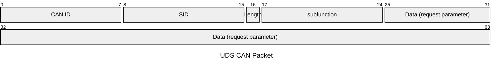

本文是本人学习UDS诊断是总结文档，如有错误希望能指出

# UDS OSI模型

{: width="972" height="589" }
_根据OSI模型实现UDS文档参考_

# 应用层服务

| 服务                            | SID  | defaultSession | 非defaultSession |
| ------------------------------- | ---- | -------------- | ---------------- |
| DiagnosticSessionControl        | 0x10 | x              | x                |
| ECUReset                        | 0x11 | x              | x                |
| SecurityAccess                  | 0x27 | unable         | x                |
| CommunicationControl            | 0x28 | unable         | x                |
| TesterPresent                   | 0x3E | x              | x                |
| AccessTimingParameter           | 0x83 | unable         | x                |
| SecuredDataTransmission         | 0x84 | unable         | x                |
| ControlDTCSetting               | 0x85 | unable         | x                |
| ResponseOnEvent                 | 0x86 | x              | x                |
| LinkControl                     | 0x87 | unable         | x                |
| ReadDataByIdentifier            | 0x22 | x              | x                |
| ReadMemoryByAddress             | 0x23 | x              | x                |
| ReadScalingDataByIdentifier     | 0x24 | x              | x                |
| ReadDataByPeriodicIdentifier    | 0x2A | unable         | x                |
| DynamicallyDefineDataIdentifier | 0x2C | x              | x                |
| WriteDataByIdentifier           | 0x2E | x              | x                |
| WriteMemoryByAddress            | 0x3D | x              | x                |
| ClearDiagnosticInformation      | 0x14 | x              | x                |
| ReadDTCInformation              | 0x19 | x              | x                |
| InputOutputControlByIdentifier  | 0x2F | unable         | x                |
| RoutineControl                  | 0x31 | x              | x                |
| requestDownload                 | 0x34 | unable         | x                |
| requestUpload                   | 0x35 | unable         | x                |
| TransferData                    | 0x36 | unable         | x                |
| RequestTransferExit             | 0x37 | unable         | X                |
| RequestFileTransfer             | 0x38 | unable         | X                |

## 寻址的客户端类别

| 寻址方式 | CANID             | 发送源  | 接收源  |
| -------- | ----------------- | ------- | ------- |
| 功能寻址 | 功能寻址 CANID    | Tester  | All ECU |
| 物理寻址 | 指定ECU 受信CANID | Tester  | 指定ECU |
| 物理寻址 | 指定ECU 送信CANID | 指定ECU | Tester  |

## 请求帧格式 request message

## DiagnosticSessionControl(0x10)服务

DiagnosticSessionControl服务用于在服务器中启用不同的诊断会话。

### request message

| A_Data字节 | 参数名称                        | Cvt | 字节值    | 助记符  |
| ---------- | ------------------------------- | --- | --------- | ------- |
| #1         | DiagnosticSessionControl请求SID | M   | 0x10      | DSC     |
| #2         | 子函数=[diagnosticSessionType]  | M   | 0x00-0xFF | LEV_DS_ |

